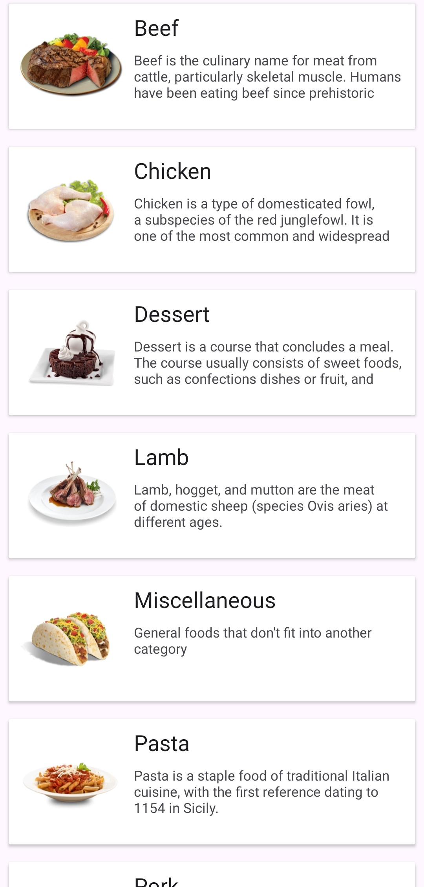
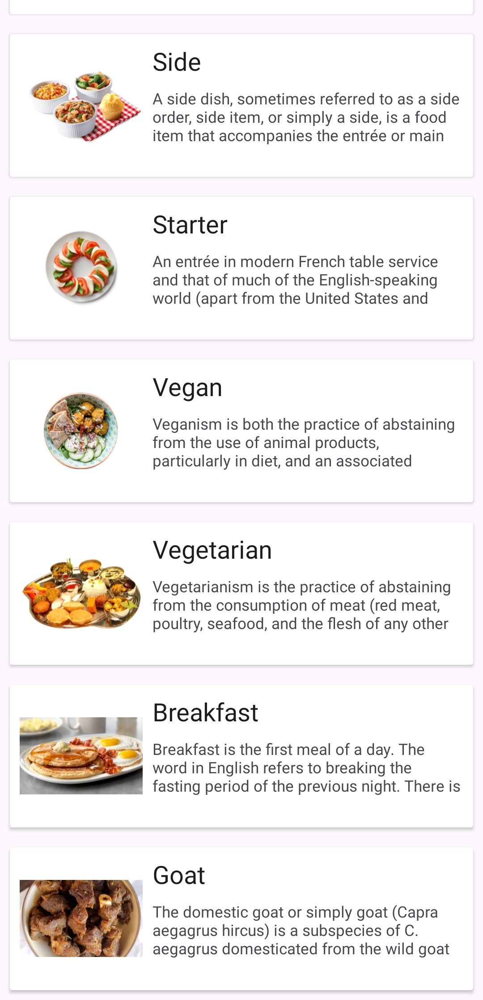

# Meals App
Display names, pictures and descriptions of a group of meals

## ScreenShots:

  
  

## APK Download
[Click here](https://drive.google.com/file/d/1Aia1zOo4fZvAODBY7sArcHOvZEiE8eKF/view?usp=sharing)

## In-App architecture

  

## Tools & APIs
- Clean architecture
- Moduels
- MVVM arch pattern
- Coroutines
- Retrofit
- Dagger Hilt
- Glide
